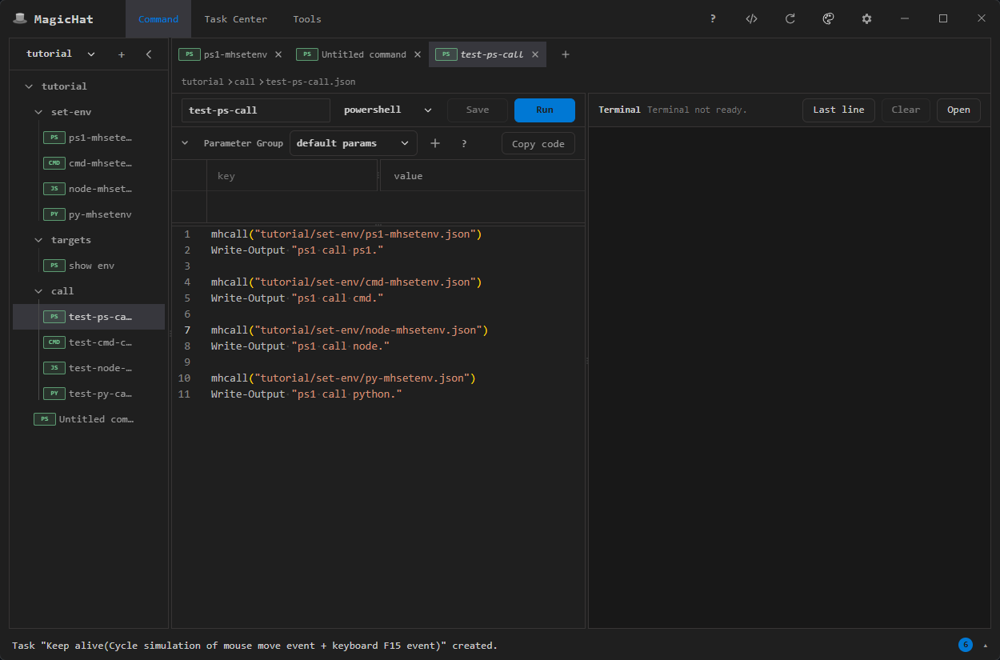
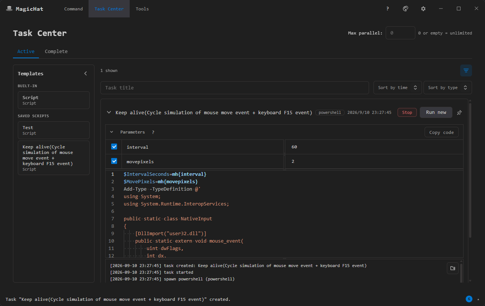
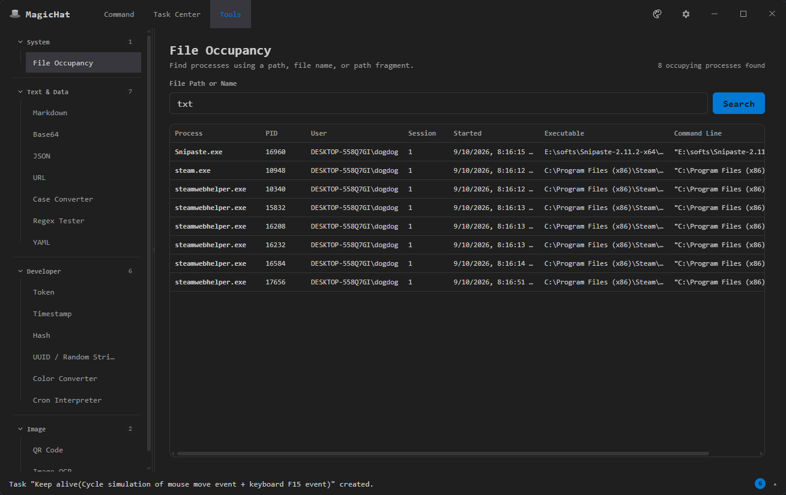

# MagicHat

[English](#english) | [中文](#中文)

## English

MagicHat is a local desktop toolbox for Windows that brings frequently used commands, script tasks, and terminal workflows into one place. It helps you turn repetitive operations into reusable commands and tasks, launch terminals, run scripts, and manage your working environment through a unified interface.

### Key features

- **Reusable command workspaces:** Organize frequently used scripts into folders and command items, define parameter groups, and use macros to adapt the same command to different projects or environments.
- **Script tasks and templates:** Create reusable PowerShell, CMD, Node.js, and Python tasks, save common setups as templates, and review task status and logs from Task Center.
- **Integrated terminal workflows:** Launch commands in MagicHat terminals and let scripts update the current command workspace environment without repeatedly copying values between tools.
- **Built-in utilities:** Use focused tools such as the Markdown editing and preview workspace or File Occupancy to inspect which processes are using a file.
- **Local-first data:** Keep commands, task definitions, templates, settings, and editable themes on your own Windows computer.

### Download

Download the latest Windows installer from [GitHub Releases](https://github.com/ddmagichat/magichat-release/releases/latest).

> The current release is available for Windows only.

### Tutorials

- [Getting Started](tutorials/getting-started.md): Install MagicHat, create your first Command, and use a Macro parameter.
- [Commands and Macros](tutorials/commands-and-macros.md): Organize Command Workspaces, reuse parameter groups, manage Workspace Env, and call saved Commands.
- [Tasks and Tools](tutorials/tasks-and-tools.md): Create script tasks and templates, inspect logs, and use the built-in utilities.

### Screenshots

#### Command workspace

#### Task center

#### Tools

### Feedback and support

- For reproducible problems, submit a [bug report](https://github.com/ddmagichat/magichat-release/issues/new?template=bug_report.md).
- To suggest an improvement, submit a [feature request](https://github.com/ddmagichat/magichat-release/issues/new?template=feature_request.md).
- For general questions and community conversations, visit [Discussions](https://github.com/ddmagichat/magichat-release/discussions).

Before attaching screenshots or logs, remove passwords, tokens, private file contents, and other sensitive information.

---

## 中文

MagicHat 是一款面向 Windows 的本地桌面工具箱, 用于集中管理日常开发和运维过程中反复使用的命令, 脚本任务与终端工作流. 你可以将零散的 PowerShell, CMD, Node.js 和 Python 脚本整理为结构化的命令项或任务模板, 通过参数与 Macro 适配不同项目和环境, 再从统一界面快速执行. MagicHat 还提供任务状态与日志查看, Markdown 编辑预览和文件占用查询等工具, 帮助减少重复输入以及在多个窗口之间来回切换.

### 主要功能

- **可复用的命令工作区:** 使用目录和命令项整理常用脚本, 为不同目录或命令配置参数组, 并通过 Macro 将参数自动替换到脚本内容中. 同一条命令可以保留多套参数配置, 便于在不同项目, 目录或运行环境之间切换.
- **脚本任务与任务模板:** 创建 PowerShell, CMD, Node.js 和 Python 脚本任务, 将重复使用的脚本, 变量和运行选项保存为模板. 任务中心集中展示任务状态, 运行信息和日志, 便于查看执行进度与排查问题.
- **集成终端工作流:** 从命令工作区直接在 MagicHat 终端中执行脚本. 脚本可以读取参数和环境配置, 也可以更新当前命令工作区的环境变量, 让后续命令继续使用运行结果, 减少手动复制和重复输入.
- **内置实用工具:** Markdown 工具提供源码编辑与实时预览, 适合编写和检查 Markdown 文档. 文件占用工具可以查询正在使用指定文件的进程, 并展示相关进程信息, 帮助定位文件无法修改, 移动或删除的原因.
- **本地优先的数据存储:** 命令, 参数, 任务定义, 任务模板, 应用设置和可编辑主题均保存在本机, 日常使用不依赖云端服务. 你可以在自己的 Windows 环境中管理这些数据和工作流.

### 下载

从 [GitHub Releases](https://github.com/ddmagichat/magichat-release/releases/latest) 下载最新的 Windows 安装包.

> 当前发布包仅支持 Windows.

### 教程

以下教程目前仅提供英文版本:

- [Getting Started](tutorials/getting-started.md): 安装 MagicHat, 创建第一个 Command, 并使用 Macro 参数.
- [Commands and Macros](tutorials/commands-and-macros.md): 组织命令工作区, 复用参数组, 管理 Workspace Env, 并调用已保存的 Command.
- [Tasks and Tools](tutorials/tasks-and-tools.md): 创建脚本任务与模板, 查看日志, 并使用内置工具.

### 截图

#### 命令工作区

#### 任务中心

#### 工具页面

### 反馈与建议

- 遇到可复现的问题, 请提交 [Bug report](https://github.com/ddmagichat/magichat-release/issues/new?template=bug_report.md).
- 有功能建议, 请提交 [Feature request](https://github.com/ddmagichat/magichat-release/issues/new?template=feature_request.md).
- 一般问题和使用交流, 请前往 [Discussions](https://github.com/ddmagichat/magichat-release/discussions).

提交截图或日志前, 请移除密码, Token, 私人文件内容和其他敏感信息.
